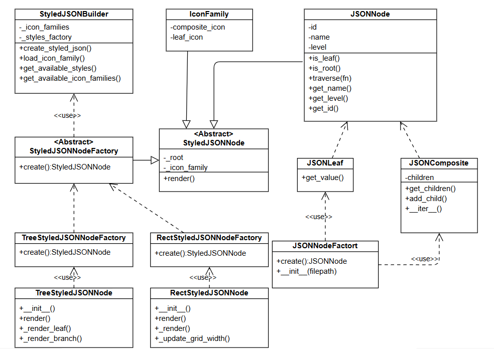
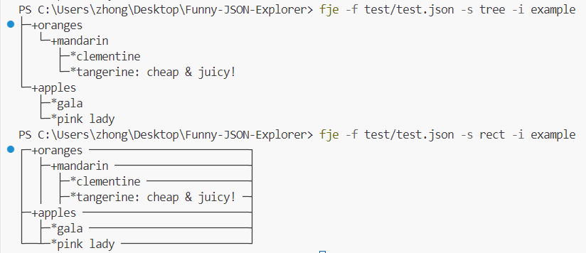
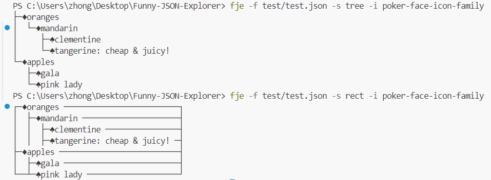

# 软件工程作业：Funny-JSON-Explorer
Funny-JSON-Explorer(FJE),是一个JSON文件可视化的命令行界面小工具
```shell
fje -f <json file> -s <style> -i <icon family>
```
FJE可以快速切换风格(style),包括：树形(tree),矩形(rectangle);
```shell
├─+name1                                    
|  ├─*name2
│  └─+name3
│     └─*name4: value4
└─*name5

┌─+name1 ───────────────┐
│  ├─*name2 ────────────┤
│  ├─+name3 ────────────┤
│  │  ├─*name4: value4 ─┤
└─*name5 ───────────────┘
```
也可以指定图标族(icon family),为中间节点或叶节点指定一套icon
```shell
┌─+oranges ─────────────────────────┐
│  ├─+mandarin ─────────────────────┤
│  │  ├─*clementine ────────────────┤
│  │  ├─*tangerine: cheap & juicy! ─┤
├─+apples ──────────────────────────┤
│  ├─*gala ─────────────────────────┤
└──┴─*pink lady ────────────────────┘

┌─♦oranges ─────────────────────────┐
│  ├─♦mandarin ─────────────────────┤
│  │  ├─♠clementine ────────────────┤
│  │  ├─♠tangerine: cheap & juicy! ─┤
├─♦apples ──────────────────────────┤
│  ├─♠gala ─────────────────────────┤
└──┴─♠pink lady ────────────────────┘
```
类图：

说明：

StyledJSONBuilder运用了建造者模式，用于创建icon集和选择风格样式，组装StyledJSONNode产品

StyledJSONNodeFactory运用了工厂模式，同时也是抽象工厂接口，用于创建其他风格的抽象工厂

TreeStyledJSONNodeFactory、RectStyledJSONNodeFactory是具体的抽象工厂，用于创建生产特定风格产品的工厂

JSONNode、JSONLeaf、JSONComposite运用了组合模式，每个JSONNode由JSONLeaf和JSONComposite组合而成

*(进阶版内容)JSONComposite运用了迭代器iter,用于递归遍历子节点

运行截图：
example-icon：

poker-face-icon-family：


Github repo URL:https://github.com/971740425/Funny-JSON-Explorer